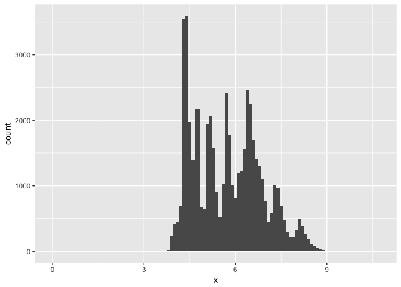
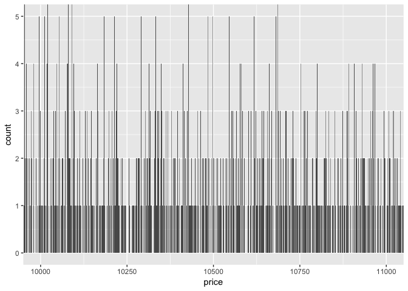
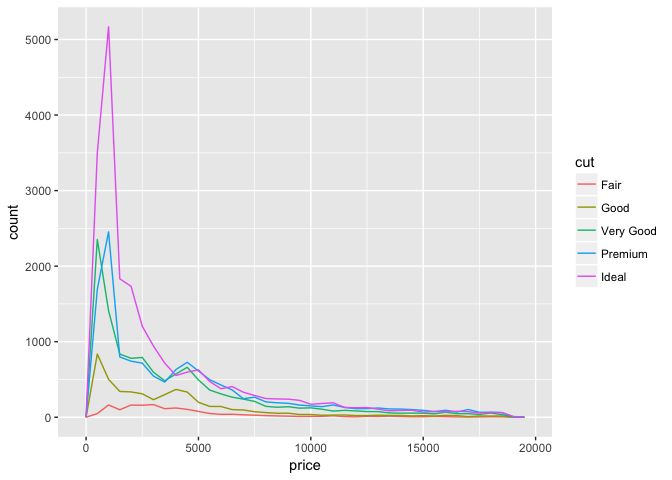
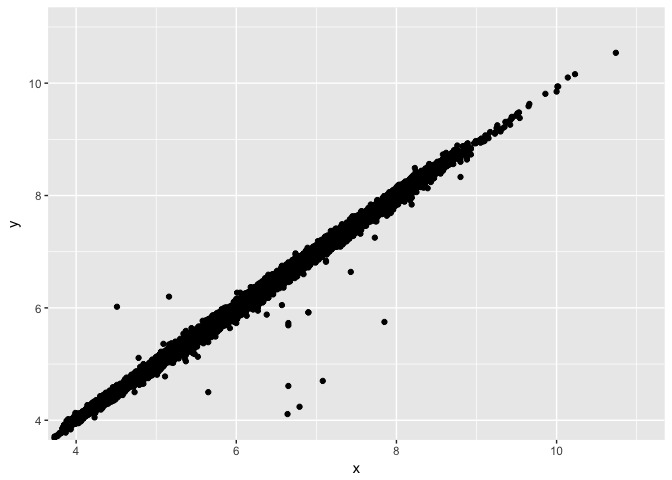

# week 7
huiyingmiao  
May 22, 2017  


```r
library(tidyverse)
```

```
## Loading tidyverse: ggplot2
## Loading tidyverse: tibble
## Loading tidyverse: tidyr
## Loading tidyverse: readr
## Loading tidyverse: purrr
## Loading tidyverse: dplyr
```

```
## Conflicts with tidy packages ----------------------------------------------
```

```
## filter(): dplyr, stats
## lag():    dplyr, stats
```


```r
ggplot(data = diamonds) +
  geom_histogram(mapping = aes(x = x), binwidth = 0.1)
```

<!-- -->

```r
diamonds %>% 
  count(cut_width(x, 0.5))
```

```
## # A tibble: 16 × 2
##    `cut_width(x, 0.5)`     n
##                 <fctr> <int>
## 1         [-0.25,0.25]     8
## 2          (3.25,3.75]     3
## 3          (3.75,4.25]  1834
## 4          (4.25,4.75] 12680
## 5          (4.75,5.25]  7502
## 6          (5.25,5.75]  6448
## 7          (5.75,6.25]  6031
## 8          (6.25,6.75]  9381
## 9          (6.75,7.25]  4193
## 10         (7.25,7.75]  3437
## 11         (7.75,8.25]  1620
## 12         (8.25,8.75]   699
## 13         (8.75,9.25]    79
## 14         (9.25,9.75]    18
## 15         (9.75,10.2]     6
## 16         (10.2,10.8]     1
```

## 7.3.4 Exercises

### 1 Explore the distribution of each of the x, y, and z variables in diamonds. What do you learn? Think about a diamond and how you might decide which dimension is the length, width, and depth.

I cannot tell which dimension is length...without documentatioin   
x:length in mm (0–10.74);y:width in mm (0–58.9);z:depth in mm (0–31.8)


```r
ggplot(data = diamonds) +
  geom_bar(mapping = aes(x = x))
```

<!-- -->

```r
diamonds %>% 
  count(x)
```

```
## # A tibble: 554 × 2
##        x     n
##    <dbl> <int>
## 1   0.00     8
## 2   3.73     2
## 3   3.74     1
## 4   3.76     1
## 5   3.77     1
## 6   3.79     2
## 7   3.81     3
## 8   3.82     2
## 9   3.83     3
## 10  3.84     4
## # ... with 544 more rows
```

```r
diamonds %>% 
  filter(x < 3.75)  %>%
  count(x)
```

```
## # A tibble: 3 × 2
##       x     n
##   <dbl> <int>
## 1  0.00     8
## 2  3.73     2
## 3  3.74     1
```

```r
smaller <- diamonds %>% 
  filter(x < 4) 
ggplot(data = smaller, mapping = aes(x = x)) +
  geom_histogram(binwidth = 0.1)
```

<!-- -->

```r
ggplot(diamonds) + 
  geom_histogram(mapping = aes(x = x), binwidth = 0.5) +
  coord_cartesian(ylim = c(0, 50))
```

<!-- -->


```r
ggplot(data = diamonds) +
  geom_bar(mapping = aes(x = y))
```

<!-- -->

```r
ggplot(diamonds) + 
  geom_histogram(mapping = aes(x = y), binwidth = 0.5) +
  coord_cartesian(xlim = c(0, 10))
```

<!-- -->


```r
ggplot(data = diamonds) +
  geom_bar(mapping = aes(x = z))
```

<!-- -->

```r
ggplot(diamonds) + 
  geom_histogram(mapping = aes(x = z), binwidth = 0.5) +
  coord_cartesian(xlim = c(0, 10))
```

<!-- -->


### 2 Explore the distribution of price. Do you discover anything unusual or surprising? (Hint: Carefully think about the binwidth and make sure you try a wide range of values.)


```r
ggplot(diamonds) + 
  geom_histogram(mapping = aes(x = price), binwidth = 1)+ 
coord_cartesian(ylim = c(0, 10))
```

<!-- -->

```r
ggplot( filter(diamonds,  price> 10000)) + 
  geom_histogram(mapping = aes(x = price), binwidth = 1) +
  coord_cartesian(ylim = c(0, 10))
```

<!-- -->

```r
diamonds %>%
  
  count(price>=17500)
```

```
## # A tibble: 2 × 2
##   `price >= 17500`     n
##              <lgl> <int>
## 1            FALSE 53447
## 2             TRUE   493
```


### 3 How many diamonds are 0.99 carat? How many are 1 carat? What do you think is the cause of the difference?


```r
diamonds %>% 
  filter(carat>=0.99 & carat<=1)%>%
  count(carat)
```

```
## # A tibble: 2 × 2
##   carat     n
##   <dbl> <int>
## 1  0.99    23
## 2  1.00  1558
```

```r
diamonds %>% 
  filter(carat>=0.9 & carat<=1.1)%>%
  count(carat)
```

```
## # A tibble: 21 × 2
##    carat     n
##    <dbl> <int>
## 1   0.90  1485
## 2   0.91   570
## 3   0.92   226
## 4   0.93   142
## 5   0.94    59
## 6   0.95    65
## 7   0.96   103
## 8   0.97    59
## 9   0.98    31
## 10  0.99    23
## # ... with 11 more rows
```
No big difference in price between 1 and 0.99...Maybe 1carat sounds good? or means more reward?


### 4 Compare and contrast coord_cartesian() vs xlim() or ylim() when zooming in on a histogram. What happens if you leave binwidth unset? What happens if you try and zoom so only half a bar shows?

xlim(ylim)will remove non-finite values.

```r
ggplot(diamonds) + 
  geom_histogram(mapping = aes(x = price), binwidth = 1) +
  coord_cartesian(xlim = c(10000, 11000),ylim = c(0, 5))
```

<!-- -->


```r
ggplot(diamonds) + 
  geom_histogram(mapping = aes(x = price), binwidth = 1) +
 xlim (10000, 11000) +
 ylim (0, 5)
```

```
## Warning: Removed 53005 rows containing non-finite values (stat_bin).
```

```
## Warning: Removed 5 rows containing missing values (geom_bar).
```

<!-- -->

with or without binwidth


```r
ggplot(diamonds) + 
  geom_histogram(mapping = aes(x = price),binwidth = 1) +
 xlim (100, 11000) +
 ylim (0, 500)
```

```
## Warning: Removed 4288 rows containing non-finite values (stat_bin).
```

<!-- -->


```r
ggplot(diamonds) + 
  geom_histogram(mapping = aes(x = price)) +
 xlim (100, 11000) +
 ylim (0, 500)
```

```
## `stat_bin()` using `bins = 30`. Pick better value with `binwidth`.
```

```
## Warning: Removed 4288 rows containing non-finite values (stat_bin).
```

```
## Warning: Removed 23 rows containing missing values (geom_bar).
```

<!-- -->

## 7.4.1 Exercises

### 1 What happens to missing values in a histogram? What happens to missing values in a bar chart? Why is there a difference?

missing values are dropped in histogram,AND are a category in bar chart.   
In a histogram, the x aesthetic variable needs to be numeric, and stat_bin groups the observations by ranges into bins. Since the numeric value of the NA observations is unknown, they cannot be placed in a particular bin, and are dropped.


```r
diamonds2 <- diamonds %>% 
  mutate(y = ifelse(y < 3 | y > 20, NA, y))
ggplot(diamonds2,aes(x = y)) +
  geom_histogram()
```

```
## `stat_bin()` using `bins = 30`. Pick better value with `binwidth`.
```

```
## Warning: Removed 9 rows containing non-finite values (stat_bin).
```

<!-- -->


```r
diamonds2 <- diamonds %>% 
  mutate(y = ifelse(y < 3 | y > 20, NA, y))
ggplot(diamonds2,aes(x = y)) +
  geom_bar()
```

```
## Warning: Removed 9 rows containing non-finite values (stat_count).
```

<!-- -->


### 2 What does na.rm = TRUE do in mean() and sum()?

remove NA before calculating

```r
mean(c(0, 1, 2, NA), na.rm = TRUE)
```

```
## [1] 1
```

```r
sum(c(0, 1, 2, NA), na.rm = TRUE)
```

```
## [1] 3
```

## 7.5

```r
ggplot(data = diamonds, mapping = aes(x = price)) + 
  geom_freqpoly(mapping = aes(colour = cut), binwidth = 100)
```

<!-- -->

```r
ggplot(data = diamonds, mapping = aes(x = price, y = ..density..)) + 
  geom_freqpoly(mapping = aes(colour = cut), binwidth = 500)
```

<!-- -->


```r
ggplot(data = diamonds, mapping = aes(x = cut, y = price)) +
  geom_boxplot()
```

<!-- -->

```r
ggplot(data = diamonds, mapping = aes(x = cut, y = price)) +
  geom_point(size=0.1)
```

<!-- -->


### 7.5.1.1 Exercises

### 1 Use what you’ve learned to improve the visualisation of the departure times of cancelled vs. non-cancelled flights.


```r
nycflights13::flights %>% 
  mutate(
    cancelled = is.na(dep_time),
    sched_hour = sched_dep_time %/% 100,
    sched_min = sched_dep_time %% 100,
    sched_dep_time = sched_hour + sched_min / 60
  ) %>% 
  ggplot() +
    geom_boxplot(mapping = aes(y = sched_dep_time, x = cancelled))
```

<!-- -->


### 2 What variable in the diamonds dataset is most important for predicting the price of a diamond? How is that variable correlated with cut? Why does the combination of those two relationships lead to lower quality diamonds being more expensive?

carat? lower quality diamonds are bigger?

```r
ggplot(data = diamonds, mapping = aes(x = cut, y = carat)) +
  geom_boxplot()
```

<!-- -->


### 3 Install the ggstance package, and create a horizontal boxplot. How does this compare to using coord_flip()?

install.packages("ggstance")
library("ggstance")


```r
ggplot(data = mpg) +
  geom_boxplot(mapping = aes(x = reorder(class, hwy, FUN = median), y = hwy)) +
  coord_flip()
```

<!-- -->


ggplot(data = mpg) +
  geom_boxploth(mapping = aes(y = reorder(class, hwy, FUN = median), x = hwy))
  
```

### 4 One problem with boxplots is that they were developed in an era of much smaller datasets and tend to display a prohibitively large number of “outlying values”. One approach to remedy this problem is the letter value plot. Install the lvplot package, and try using geom_lv() to display the distribution of price vs cut. What do you learn? How do you interpret the plots?


ggplot(diamonds, aes(x = cut, y = price)) +
  geom_lv()
```

### 5 Compare and contrast geom_violin() with a facetted geom_histogram(), or a coloured geom_freqpoly(). What are the pros and cons of each method?


```r
ggplot(data = diamonds, mapping = aes(x = price)) + 
  geom_freqpoly(mapping = aes(colour = cut), binwidth = 500)
```

<!-- -->


```r
ggplot(data = diamonds, mapping = aes(x = price)) +
  geom_histogram() +
  facet_wrap(~ cut, ncol = 1, scales = "free_y")
```

```
## `stat_bin()` using `bins = 30`. Pick better value with `binwidth`.
```

<!-- -->


```r
ggplot(data = diamonds, mapping = aes(x = cut, y = price)) +
  geom_violin() +
  coord_flip()
```

<!-- -->


### 6 If you have a small dataset, it’s sometimes useful to use geom_jitter() to see the relationship between a continuous and categorical variable. The ggbeeswarm package provides a number of methods similar to geom_jitter(). List them and briefly describe what each one does.
****

install.packages("ggbeeswarm")
library("ggbeeswarm")
```

geom_quasirandom and geom_beeswarm


ggplot(data = mpg) +
  geom_quasirandom(mapping = aes(x = reorder(class, hwy, FUN = median),
                                 y = hwy))
```

===============================


```r
diamonds %>% 
  count(color, cut) %>%  
  ggplot(mapping = aes(x = color, y = cut)) +
    geom_tile(mapping = aes(fill = n))
```

<!-- -->

**d3heatmap or heatmaply packages**

##7.5.2.1 Exercises

### 1 How could you rescale the count dataset above to more clearly show the distribution of cut within colour, or colour within cut?

### 2 Use geom_tile() together with dplyr to explore how average flight delays vary by destination and month of year. What makes the plot difficult to read? How could you improve it?


```r
nycflights13::flights %>%
  group_by(month, dest) %>%
  summarise(dep_delay = mean(dep_delay, na.rm = TRUE)) %>%
  ggplot(aes(x = factor(month), y = dest, fill = dep_delay)) +
  geom_tile() 
```

<!-- -->


### 3 Why is it slightly better to use aes(x = color, y = cut) rather than aes(x = cut, y = color) in the example above?

use variables with the longer labels on y axis

7.5.3 Two continuous variables


```r
ggplot(data = diamonds) +
  geom_point(mapping = aes(x = carat, y = price))
```

<!-- -->


```r
ggplot(data = diamonds) + 
  geom_point(mapping = aes(x = carat, y = price), alpha = 1 / 100)
```

<!-- -->


```r
ggplot(data = diamonds) +
  geom_bin2d(mapping = aes(x = carat, y = price))
```

<!-- -->

```r
ggplot(data = smaller) +
  geom_hex(mapping = aes(x = carat, y = price))
```

<!-- -->

```r
ggplot(data = diamonds, mapping = aes(x = carat, y = price)) + 
  geom_boxplot(mapping = aes(group = cut_width(carat, 0.1)),varwidth = TRUE)
```

<!-- -->

```r
ggplot(data = diamonds, mapping = aes(x = carat, y = price)) + 
  geom_boxplot(mapping = aes(group = cut_width(carat, 0.1)))
```

<!-- -->

```r
ggplot(data = diamonds, mapping = aes(x = carat, y = price)) + 
  geom_boxplot(mapping = aes(group = cut_number(carat, 20)))
```

<!-- -->

## 7.5.3.1 Exercises

### 1 Instead of summarising the conditional distribution with a boxplot, you could use a frequency polygon. What do you need to consider when using cut_width() vs cut_number()? How does that impact a visualisation of the 2d distribution of carat and price?


```r
ggplot(data = diamonds, 
       mapping = aes(x = price,
                     colour = cut_width(carat, 0.3))) +
  geom_freqpoly()
```

```
## `stat_bin()` using `bins = 30`. Pick better value with `binwidth`.
```

<!-- -->

```r
ggplot(data = diamonds, 
       mapping = aes(x = price,
                     colour = cut_number(carat, 10))) +
  geom_freqpoly()
```

```
## `stat_bin()` using `bins = 30`. Pick better value with `binwidth`.
```

<!-- -->


### 2 Visualise the distribution of carat, partitioned by price.


```r
ggplot(diamonds, aes(x = cut_number(price, 10), y = carat)) +
  geom_boxplot() +
  coord_flip()
```

<!-- -->

```r
ggplot(diamonds, aes(x = cut_width(price, 2000, boundary = 0), y = carat)) +
  geom_boxplot(varwidth = TRUE) +
  coord_flip() 
```

<!-- -->


### 3 How does the price distribution of very large diamonds compare to small diamonds. Is it as you expect, or does it surprise you?

 for a certain size, other factors such as cut, clarity, color play more of a role in the price.
 
### 4 Combine two of the techniques you’ve learned to visualise the combined distribution of cut, carat, and price.

```r
ggplot(diamonds, aes(x = cut_number(carat, 5), y = price, color = cut)) +
  geom_boxplot()
```

<!-- -->
### 5 Two dimensional plots reveal outliers that are not visible in one dimensional plots. For example, some points in the plot below have an unusual combination of x and y values, which makes the points outliers even though their x and y values appear normal when examined separately.
Why is a scatterplot a better display than a binned plot for this case?

```r
ggplot(data = diamonds) +
  geom_point(mapping = aes(x = x, y = y)) +
  coord_cartesian(xlim = c(4, 11), ylim = c(4, 11))
```

<!-- -->

unusual values will be binned normally~
