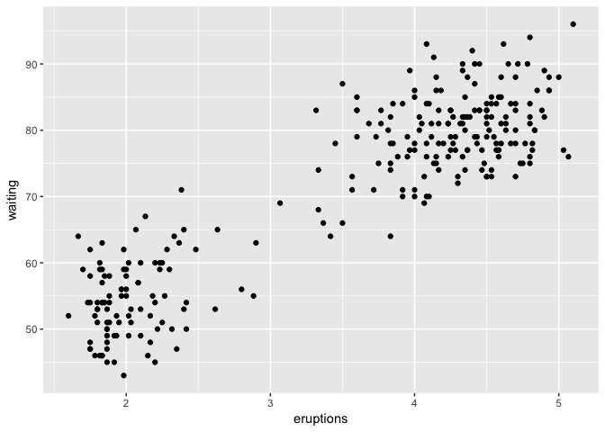
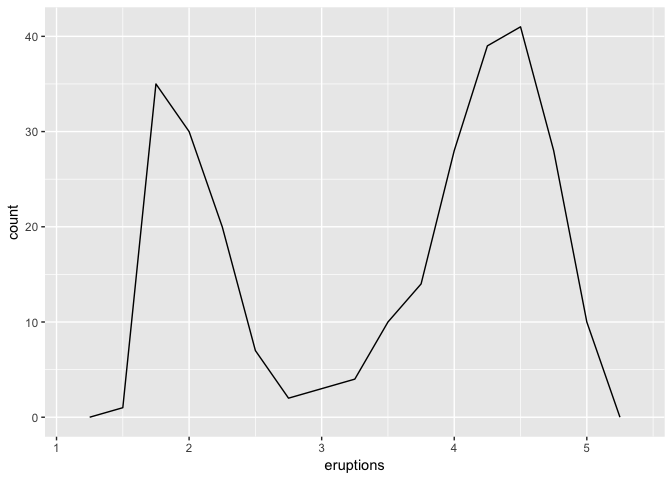
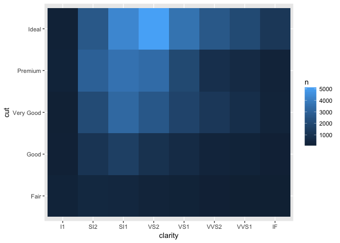
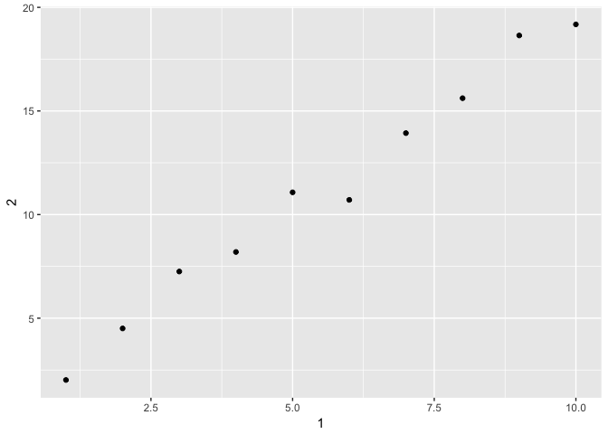

# week8
huiyingmiao  
May 30, 2017  


```r
library(ggplot2)
```

#7 go on

```r
ggplot(data=faithful)+
  geom_point(mapping=aes(x=eruptions,y=waiting))
```

<!-- -->

```r
ggplot(data = faithful, mapping = aes(x = eruptions)) + 
  geom_freqpoly(binwidth = 0.25)
```

<!-- -->

```r
ggplot(faithful,aes(eruptions))+
  geom_freqpoly(binwidth=0.25)
```

<!-- -->
the later is more concisely~


```r
library(tidyverse)
```

```
## Loading tidyverse: tibble
## Loading tidyverse: tidyr
## Loading tidyverse: readr
## Loading tidyverse: purrr
## Loading tidyverse: dplyr
```

```
## Conflicts with tidy packages ----------------------------------------------
```

```
## filter(): dplyr, stats
## lag():    dplyr, stats
```

```r
diamonds%>%
  count(cut,clarity)%>%
  ggplot(aes(clarity,cut,fill=n))+
  geom_tile()
```

<!-- -->

# 10 Tibbles


```r
library(tidyverse)
```

**coerce a data frame to a tibble**

```r
as_tibble(iris)
```

```
## # A tibble: 150 × 5
##    Sepal.Length Sepal.Width Petal.Length Petal.Width Species
##           <dbl>       <dbl>        <dbl>       <dbl>  <fctr>
## 1           5.1         3.5          1.4         0.2  setosa
## 2           4.9         3.0          1.4         0.2  setosa
## 3           4.7         3.2          1.3         0.2  setosa
## 4           4.6         3.1          1.5         0.2  setosa
## 5           5.0         3.6          1.4         0.2  setosa
## 6           5.4         3.9          1.7         0.4  setosa
## 7           4.6         3.4          1.4         0.3  setosa
## 8           5.0         3.4          1.5         0.2  setosa
## 9           4.4         2.9          1.4         0.2  setosa
## 10          4.9         3.1          1.5         0.1  setosa
## # ... with 140 more rows
```
**create a tibble**

```r
tibble(
  x=1:5,
  y=1,
  z=x^2+y
)
```

```
## # A tibble: 5 × 3
##       x     y     z
##   <int> <dbl> <dbl>
## 1     1     1     2
## 2     2     1     5
## 3     3     1    10
## 4     4     1    17
## 5     5     1    26
```
**tibble never converts strings to factors!**

**To refer to non-syntactic names(not start with a letter), you need to surround them with backticks, `:**


```r
tb<-tibble(
`:)`="smile",
` `="space",
`2000`="number"
)
tb
```

```
## # A tibble: 1 × 3
##    `:)`   ` ` `2000`
##   <chr> <chr>  <chr>
## 1 smile space number
```

** tribble(), short for transposed tibble.they start with ~, and entries are separated by commas.**

```r
tribble(
  ~x,~y,~z,
  #---/---
  "a",1,2,
  "b",3,4
)
```

```
## # A tibble: 2 × 3
##       x     y     z
##   <chr> <dbl> <dbl>
## 1     a     1     2
## 2     b     3     4
```

#####tibble vs data frame


```r
ttb<-tibble(
  a=1:12,
  b=a^3+6,
  c=log(a),
  d=2.2,
  e=a*b-c+d,
  f=1,
  g=6,
  h=2,
  i=1,
  j=66,
  k=11,
  l=66
)
ttb%>%
  print(n=12,width=Inf) #why don't output 12 rows....
```

```
## # A tibble: 12 × 12
##        a     b         c     d           e     f     g     h     i     j
##    <int> <dbl>     <dbl> <dbl>       <dbl> <dbl> <dbl> <dbl> <dbl> <dbl>
## 1      1     7 0.0000000   2.2     9.20000     1     6     2     1    66
## 2      2    14 0.6931472   2.2    29.50685     1     6     2     1    66
## 3      3    33 1.0986123   2.2   100.10139     1     6     2     1    66
## 4      4    70 1.3862944   2.2   280.81371     1     6     2     1    66
## 5      5   131 1.6094379   2.2   655.59056     1     6     2     1    66
## 6      6   222 1.7917595   2.2  1332.40824     1     6     2     1    66
## 7      7   349 1.9459101   2.2  2443.25409     1     6     2     1    66
## 8      8   518 2.0794415   2.2  4144.12056     1     6     2     1    66
## 9      9   735 2.1972246   2.2  6615.00278     1     6     2     1    66
## 10    10  1006 2.3025851   2.2 10059.89741     1     6     2     1    66
## 11    11  1337 2.3978953   2.2 14706.80210     1     6     2     1    66
## 12    12  1734 2.4849066   2.2 20807.71509     1     6     2     1    66
##        k     l
##    <dbl> <dbl>
## 1     11    66
## 2     11    66
## 3     11    66
## 4     11    66
## 5     11    66
## 6     11    66
## 7     11    66
## 8     11    66
## 9     11    66
## 10    11    66
## 11    11    66
## 12    11    66
```

```r
ttb
```

```
## # A tibble: 12 × 12
##        a     b         c     d           e     f     g     h     i     j
##    <int> <dbl>     <dbl> <dbl>       <dbl> <dbl> <dbl> <dbl> <dbl> <dbl>
## 1      1     7 0.0000000   2.2     9.20000     1     6     2     1    66
## 2      2    14 0.6931472   2.2    29.50685     1     6     2     1    66
## 3      3    33 1.0986123   2.2   100.10139     1     6     2     1    66
## 4      4    70 1.3862944   2.2   280.81371     1     6     2     1    66
## 5      5   131 1.6094379   2.2   655.59056     1     6     2     1    66
## 6      6   222 1.7917595   2.2  1332.40824     1     6     2     1    66
## 7      7   349 1.9459101   2.2  2443.25409     1     6     2     1    66
## 8      8   518 2.0794415   2.2  4144.12056     1     6     2     1    66
## 9      9   735 2.1972246   2.2  6615.00278     1     6     2     1    66
## 10    10  1006 2.3025851   2.2 10059.89741     1     6     2     1    66
## 11    11  1337 2.3978953   2.2 14706.80210     1     6     2     1    66
## 12    12  1734 2.4849066   2.2 20807.71509     1     6     2     1    66
## # ... with 2 more variables: k <dbl>, l <dbl>
```

```r
class(ttb)
```

```
## [1] "tbl_df"     "tbl"        "data.frame"
```

** pull out a single variable.**
**$ and [[. [[ can extract by name or position; $ only extracts by name but is a little less typing.**


```r
#extract by name
ttb$a
```

```
##  [1]  1  2  3  4  5  6  7  8  9 10 11 12
```

```r
ttb[["a"]]
```

```
##  [1]  1  2  3  4  5  6  7  8  9 10 11 12
```

```r
#extract by position
ttb[[2]]
```

```
##  [1]    7   14   33   70  131  222  349  518  735 1006 1337 1734
```

```r
class(as_data_frame(ttb))
```

```
## [1] "tbl_df"     "tbl"        "data.frame"
```

##10.5 Exercises

### 1 How can you tell if an object is a tibble? (Hint: try printing mtcars, which is a regular data frame).

```r
mtcars 
```

```
##                      mpg cyl  disp  hp drat    wt  qsec vs am gear carb
## Mazda RX4           21.0   6 160.0 110 3.90 2.620 16.46  0  1    4    4
## Mazda RX4 Wag       21.0   6 160.0 110 3.90 2.875 17.02  0  1    4    4
## Datsun 710          22.8   4 108.0  93 3.85 2.320 18.61  1  1    4    1
## Hornet 4 Drive      21.4   6 258.0 110 3.08 3.215 19.44  1  0    3    1
## Hornet Sportabout   18.7   8 360.0 175 3.15 3.440 17.02  0  0    3    2
## Valiant             18.1   6 225.0 105 2.76 3.460 20.22  1  0    3    1
## Duster 360          14.3   8 360.0 245 3.21 3.570 15.84  0  0    3    4
## Merc 240D           24.4   4 146.7  62 3.69 3.190 20.00  1  0    4    2
## Merc 230            22.8   4 140.8  95 3.92 3.150 22.90  1  0    4    2
## Merc 280            19.2   6 167.6 123 3.92 3.440 18.30  1  0    4    4
## Merc 280C           17.8   6 167.6 123 3.92 3.440 18.90  1  0    4    4
## Merc 450SE          16.4   8 275.8 180 3.07 4.070 17.40  0  0    3    3
## Merc 450SL          17.3   8 275.8 180 3.07 3.730 17.60  0  0    3    3
## Merc 450SLC         15.2   8 275.8 180 3.07 3.780 18.00  0  0    3    3
## Cadillac Fleetwood  10.4   8 472.0 205 2.93 5.250 17.98  0  0    3    4
## Lincoln Continental 10.4   8 460.0 215 3.00 5.424 17.82  0  0    3    4
## Chrysler Imperial   14.7   8 440.0 230 3.23 5.345 17.42  0  0    3    4
## Fiat 128            32.4   4  78.7  66 4.08 2.200 19.47  1  1    4    1
## Honda Civic         30.4   4  75.7  52 4.93 1.615 18.52  1  1    4    2
## Toyota Corolla      33.9   4  71.1  65 4.22 1.835 19.90  1  1    4    1
## Toyota Corona       21.5   4 120.1  97 3.70 2.465 20.01  1  0    3    1
## Dodge Challenger    15.5   8 318.0 150 2.76 3.520 16.87  0  0    3    2
## AMC Javelin         15.2   8 304.0 150 3.15 3.435 17.30  0  0    3    2
## Camaro Z28          13.3   8 350.0 245 3.73 3.840 15.41  0  0    3    4
## Pontiac Firebird    19.2   8 400.0 175 3.08 3.845 17.05  0  0    3    2
## Fiat X1-9           27.3   4  79.0  66 4.08 1.935 18.90  1  1    4    1
## Porsche 914-2       26.0   4 120.3  91 4.43 2.140 16.70  0  1    5    2
## Lotus Europa        30.4   4  95.1 113 3.77 1.513 16.90  1  1    5    2
## Ford Pantera L      15.8   8 351.0 264 4.22 3.170 14.50  0  1    5    4
## Ferrari Dino        19.7   6 145.0 175 3.62 2.770 15.50  0  1    5    6
## Maserati Bora       15.0   8 301.0 335 3.54 3.570 14.60  0  1    5    8
## Volvo 142E          21.4   4 121.0 109 4.11 2.780 18.60  1  1    4    2
```


```r
class(mtcars)# tibble has "tbl_df"     "tbl"    
```

```
## [1] "data.frame"
```

```r
class(as_tibble(mtcars))
```

```
## [1] "tbl_df"     "tbl"        "data.frame"
```


### 2 Compare and contrast the following operations on a data.frame and equivalent tibble. What is different? Why might the default data frame behaviours cause you frustration?

**tibbles are more strict: they never do partial matching**


```r
df <- data.frame(abc = 1, xyz = "a")
df$x #partial matching
```

```
## [1] a
## Levels: a
```

```r
df[, "xyz"] # returns a vector, rather than a data frame
```

```
## [1] a
## Levels: a
```

```r
df[, c("abc", "xyz")]
```

```
##   abc xyz
## 1   1   a
```


```r
tbdf<-as_tibble(df)
tbdf$x
```

```
## Warning: Unknown or uninitialised column: 'x'.
```

```
## NULL
```

```r
tbdf[, "xyz"]
```

```
## # A tibble: 1 × 1
##      xyz
##   <fctr>
## 1      a
```

```r
tbdf[, c("abc", "xyz")]
```

```
## # A tibble: 1 × 2
##     abc    xyz
##   <dbl> <fctr>
## 1     1      a
```
### 3 If you have the name of a variable stored in an object, e.g. var <- "mpg", how can you extract the reference variable from a tibble?

use var[["mpg"]] or var$mpg

### 4 Practice referring to non-syntactic names in the following data frame by:

1 Extracting the variable called 1.

2 Plotting a scatterplot of 1 vs 2.

3 Creating a new column called 3 which is 2 divided by 1.

4 Renaming the columns to one, two and three.


```r
annoying <- tibble(
  `1` = 1:10,
  `2` = `1` * 2 + rnorm(length(`1`))
)
#extract variable 1
annoying[["1"]]
```

```
##  [1]  1  2  3  4  5  6  7  8  9 10
```

```r
annoying$`2`
```

```
##  [1]  2.018006  4.505740  7.252762  8.194673 11.073425 10.709339 13.931381
##  [8] 15.616215 18.643772 19.178277
```

```r
#plot
ggplot(annoying, aes(x=`1`, y=`2`))+
  geom_point()
```

<!-- -->

```r
annoying%>%
  mutate(`3`=`2`/`1`)
```

```
## # A tibble: 10 × 3
##      `1`       `2`      `3`
##    <int>     <dbl>    <dbl>
## 1      1  2.018006 2.018006
## 2      2  4.505740 2.252870
## 3      3  7.252762 2.417587
## 4      4  8.194673 2.048668
## 5      5 11.073425 2.214685
## 6      6 10.709339 1.784890
## 7      7 13.931381 1.990197
## 8      8 15.616215 1.952027
## 9      9 18.643772 2.071530
## 10    10 19.178277 1.917828
```

```r
#creat a new colunm
annoying[["3"]]<-annoying[["2"]]/annoying[["1"]]
#rename the columns
annoying<-rename(annoying,one=`1`,two=`2`,three=`3`)
annoying
```

```
## # A tibble: 10 × 3
##      one       two    three
##    <int>     <dbl>    <dbl>
## 1      1  2.018006 2.018006
## 2      2  4.505740 2.252870
## 3      3  7.252762 2.417587
## 4      4  8.194673 2.048668
## 5      5 11.073425 2.214685
## 6      6 10.709339 1.784890
## 7      7 13.931381 1.990197
## 8      8 15.616215 1.952027
## 9      9 18.643772 2.071530
## 10    10 19.178277 1.917828
```

### 5 What does tibble::enframe() do? When might you use it?
*enframe() converts named atomic vectors or lists to two-column data frames. For unnamed vectors, the natural sequence is used as name column.*

*deframe() converts two-column data frames to a named vector or list, using the first column as name and the second column as value.*


```r
tibble::enframe(c(x=1,y=2,h=3)) #named vector
```

```
## # A tibble: 3 × 2
##    name value
##   <chr> <dbl>
## 1     x     1
## 2     y     2
## 3     h     3
```

```r
tibble::enframe(c(1,6,3)) #unamed vector
```

```
## # A tibble: 3 × 2
##    name value
##   <int> <dbl>
## 1     1     1
## 2     2     6
## 3     3     3
```

### 6 What option controls how many additional column names are printed at the footer of a tibble?
print.tbl_df

print(x, ..., n = NULL, width = NULL, n_extra = NULL)

