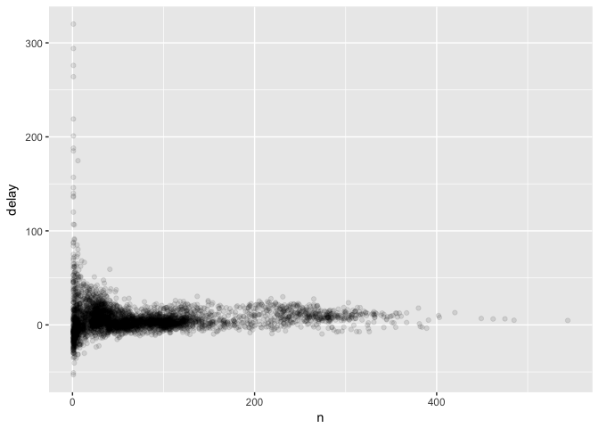
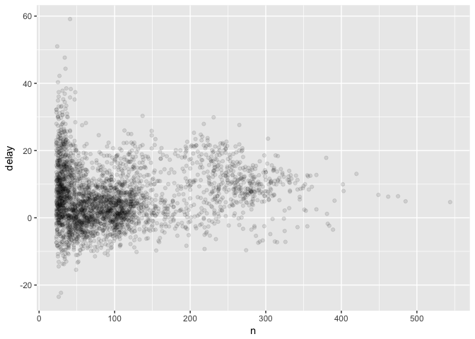
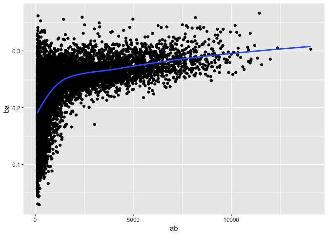
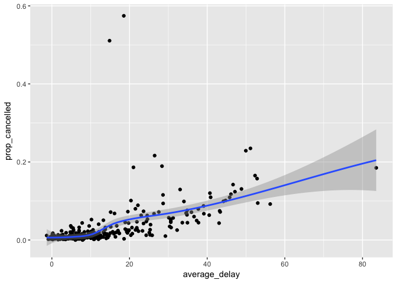
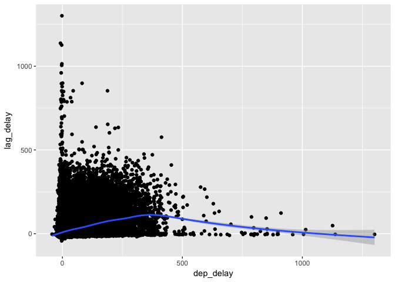

# assignment6
huiyingmiao  
May 16, 2017  


```r
library(nycflights13)
library(tidyverse)
```

```
## Loading tidyverse: ggplot2
## Loading tidyverse: tibble
## Loading tidyverse: tidyr
## Loading tidyverse: readr
## Loading tidyverse: purrr
## Loading tidyverse: dplyr
```

```
## Conflicts with tidy packages ----------------------------------------------
```

```
## filter(): dplyr, stats
## lag():    dplyr, stats
```


```r
not_cancelled <- flights %>% 
  filter(!is.na(dep_delay), !is.na(arr_delay))

not_cancelled %>% 
  group_by(year, month, day) %>% 
  summarise(mean = mean(dep_delay))
```

```
## Source: local data frame [365 x 4]
## Groups: year, month [?]
## 
##     year month   day      mean
##    <int> <int> <int>     <dbl>
## 1   2013     1     1 11.435620
## 2   2013     1     2 13.677802
## 3   2013     1     3 10.907778
## 4   2013     1     4  8.965859
## 5   2013     1     5  5.732218
## 6   2013     1     6  7.145959
## 7   2013     1     7  5.417204
## 8   2013     1     8  2.558296
## 9   2013     1     9  2.301232
## 10  2013     1    10  2.844995
## # ... with 355 more rows
```


```r
delays <- not_cancelled %>% 
  group_by(tailnum) %>% 
  summarise(
    delay = mean(arr_delay, na.rm = TRUE),
    n = n()
  )

ggplot(data = delays, mapping = aes(x = n, y = delay)) + 
  geom_point(alpha = 1/10)
```

<!-- -->


```r
delays %>% 
  filter(n > 22) %>% 
  ggplot(mapping = aes(x = n, y = delay)) + 
    geom_point(alpha = 1/10)
```

<!-- -->


install.packages("Lahman")


```r
batting <- as_tibble(Lahman::Batting)

batters <- batting %>% 
  group_by(playerID) %>% 
  summarise(
    ba = sum(H, na.rm = TRUE) / sum(AB, na.rm = TRUE),
    ab = sum(AB, na.rm = TRUE)
  )

batters %>% 
  filter(ab > 100) %>% 
  ggplot(mapping = aes(x = ab, y = ba)) +
    geom_point() + 
    geom_smooth(se = FALSE)
```

```
## `geom_smooth()` using method = 'gam'
```

<!-- -->


```r
not_cancelled %>% 
  group_by(year, month, day) %>% 
  summarise(
    avg_delay1 = mean(arr_delay),
    avg_delay2 = mean(arr_delay[arr_delay > 0]) 
  )
```

```
## Source: local data frame [365 x 5]
## Groups: year, month [?]
## 
##     year month   day avg_delay1 avg_delay2
##    <int> <int> <int>      <dbl>      <dbl>
## 1   2013     1     1 12.6510229   32.48156
## 2   2013     1     2 12.6928879   32.02991
## 3   2013     1     3  5.7333333   27.66087
## 4   2013     1     4 -1.9328194   28.30976
## 5   2013     1     5 -1.5258020   22.55882
## 6   2013     1     6  4.2364294   24.37270
## 7   2013     1     7 -4.9473118   27.76132
## 8   2013     1     8 -3.2275785   20.78909
## 9   2013     1     9 -0.2642777   25.63415
## 10  2013     1    10 -5.8988159   27.34545
## # ... with 355 more rows
```


```r
flights
```

```
## # A tibble: 336,776 × 19
##     year month   day dep_time sched_dep_time dep_delay arr_time
##    <int> <int> <int>    <int>          <int>     <dbl>    <int>
## 1   2013     1     1      517            515         2      830
## 2   2013     1     1      533            529         4      850
## 3   2013     1     1      542            540         2      923
## 4   2013     1     1      544            545        -1     1004
## 5   2013     1     1      554            600        -6      812
## 6   2013     1     1      554            558        -4      740
## 7   2013     1     1      555            600        -5      913
## 8   2013     1     1      557            600        -3      709
## 9   2013     1     1      557            600        -3      838
## 10  2013     1     1      558            600        -2      753
## # ... with 336,766 more rows, and 12 more variables: sched_arr_time <int>,
## #   arr_delay <dbl>, carrier <chr>, flight <int>, tailnum <chr>,
## #   origin <chr>, dest <chr>, air_time <dbl>, distance <dbl>, hour <dbl>,
## #   minute <dbl>, time_hour <dttm>
```

##### Measures of spread: sd(x), IQR(x), mad(x). The mean squared deviation, or standard deviation or sd for short, is the standard measure of spread. The interquartile range IQR() and median absolute deviation mad(x) are robust equivalents that may be more useful if you have outliers.


```r
not_cancelled %>% 
  group_by(dest) %>% 
  summarise(distance_sd = sd(distance)) %>% 
  arrange(desc(distance_sd))
```

```
## # A tibble: 104 × 2
##     dest distance_sd
##    <chr>       <dbl>
## 1    EGE   10.542765
## 2    SAN   10.350094
## 3    SFO   10.216017
## 4    HNL   10.004197
## 5    SEA    9.977993
## 6    LAS    9.907786
## 7    PDX    9.873299
## 8    PHX    9.862546
## 9    LAX    9.657195
## 10   IND    9.458066
## # ... with 94 more rows
```

##### Measures of rank: min(x), quantile(x, 0.25), max(x). Quantiles are a generalisation of the median. For example, quantile(x, 0.25) will find a value of x that is greater than 25% of the values, and less than the remaining 75%.


###### When do the first and last flights leave each day?


```r
not_cancelled %>% 
  group_by(year, month, day) %>% 
  summarise(
    first = min(dep_time),
    last = max(dep_time)
  )
```

```
## Source: local data frame [365 x 5]
## Groups: year, month [?]
## 
##     year month   day first  last
##    <int> <int> <int> <int> <int>
## 1   2013     1     1   517  2356
## 2   2013     1     2    42  2354
## 3   2013     1     3    32  2349
## 4   2013     1     4    25  2358
## 5   2013     1     5    14  2357
## 6   2013     1     6    16  2355
## 7   2013     1     7    49  2359
## 8   2013     1     8   454  2351
## 9   2013     1     9     2  2252
## 10  2013     1    10     3  2320
## # ... with 355 more rows
```

##### Measures of position: first(x), nth(x, 2), last(x). These work similarly to x[1], x[2], and x[length(x)] but let you set a default value if that position does not exist (i.e. you’re trying to get the 3rd element from a group that only has two elements). For example, we can find the first and last departure for each day:


```r
not_cancelled %>% 
  group_by(year, month, day) %>% 
  summarise(
    first_dep = first(dep_time), 
    sec_dep=nth(dep_time,2),
    last_dep = last(dep_time)
  )
```

```
## Source: local data frame [365 x 6]
## Groups: year, month [?]
## 
##     year month   day first_dep sec_dep last_dep
##    <int> <int> <int>     <int>   <int>    <int>
## 1   2013     1     1       517     533     2356
## 2   2013     1     2        42     126     2354
## 3   2013     1     3        32      50     2349
## 4   2013     1     4        25     106     2358
## 5   2013     1     5        14      37     2357
## 6   2013     1     6        16     458     2355
## 7   2013     1     7        49     454     2359
## 8   2013     1     8       454     524     2351
## 9   2013     1     9         2       8     2252
## 10  2013     1    10         3      16     2320
## # ... with 355 more rows
```

These functions are complementary to filtering on ranks. Filtering gives you all variables, with each observation in a separate row:


```r
not_cancelled %>% 
  group_by(year, month, day) %>% 
  mutate(r = min_rank(desc(dep_time))) %>% 
  filter(r %in% range(r))
```

```
## Source: local data frame [770 x 20]
## Groups: year, month, day [365]
## 
##     year month   day dep_time sched_dep_time dep_delay arr_time
##    <int> <int> <int>    <int>          <int>     <dbl>    <int>
## 1   2013     1     1      517            515         2      830
## 2   2013     1     1     2356           2359        -3      425
## 3   2013     1     2       42           2359        43      518
## 4   2013     1     2     2354           2359        -5      413
## 5   2013     1     3       32           2359        33      504
## 6   2013     1     3     2349           2359       -10      434
## 7   2013     1     4       25           2359        26      505
## 8   2013     1     4     2358           2359        -1      429
## 9   2013     1     4     2358           2359        -1      436
## 10  2013     1     5       14           2359        15      503
## # ... with 760 more rows, and 13 more variables: sched_arr_time <int>,
## #   arr_delay <dbl>, carrier <chr>, flight <int>, tailnum <chr>,
## #   origin <chr>, dest <chr>, air_time <dbl>, distance <dbl>, hour <dbl>,
## #   minute <dbl>, time_hour <dttm>, r <int>
```


**
x <- c(5, 5,4,1, 3, 3,2, 2, NA)
row_number(x)
min_rank(x)
dense_rank(x)
percent_rank(x)
cume_dist(x)
**

##### count the number of non-missing values, use sum(!is.na(x)). To count the number of distinct (unique) values, use n_distinct(x)


Which destinations have the most carriers?

```r
not_cancelled %>% 
  group_by(dest) %>% 
  summarise(carriers = n_distinct(carrier)) %>% 
  arrange(desc(carriers))
```

```
## # A tibble: 104 × 2
##     dest carriers
##    <chr>    <int>
## 1    ATL        7
## 2    BOS        7
## 3    CLT        7
## 4    ORD        7
## 5    TPA        7
## 6    AUS        6
## 7    DCA        6
## 8    DTW        6
## 9    IAD        6
## 10   MSP        6
## # ... with 94 more rows
```

dplyr provides a simple helper if all you want is a count:

```r
not_cancelled %>% 
  count(dest) 
```

```
## # A tibble: 104 × 2
##     dest     n
##    <chr> <int>
## 1    ABQ   254
## 2    ACK   264
## 3    ALB   418
## 4    ANC     8
## 5    ATL 16837
## 6    AUS  2411
## 7    AVL   261
## 8    BDL   412
## 9    BGR   358
## 10   BHM   269
## # ... with 94 more rows
```


```r
x <- c(5, 5,4,1, 3, 3,2, 2, NA)
sum(!is.na(x))
```

```
## [1] 8
```

```r
n_distinct(x)
```

```
## [1] 6
```


```r
not_cancelled %>% 
  count(tailnum, wt = distance)
```

```
## # A tibble: 4,037 × 2
##    tailnum      n
##      <chr>  <dbl>
## 1   D942DN   3418
## 2   N0EGMQ 239143
## 3   N10156 109664
## 4   N102UW  25722
## 5   N103US  24619
## 6   N104UW  24616
## 7   N10575 139903
## 8   N105UW  23618
## 9   N107US  21677
## 10  N108UW  32070
## # ... with 4,027 more rows
```
_count(x, ..., wt = NULL, sort = FALSE)_
_ wt	(Optional) If omitted, will count the number of rows. If specified, will perform a "weighted" tally by summing the (non-missing) values of variable wt._
_sort,	if TRUE will sort output in descending order of n_

##### Counts and proportions of logical values: sum(x > 10), mean(y == 0). When used with numeric functions, TRUE is converted to 1 and FALSE to 0. This makes sum() and mean() very useful: sum(x) gives the number of TRUEs in x, and mean(x) gives the proportion.

* How many flights left before 5am? (these usually indicate delayed flights from the previous day)

```r
not_cancelled %>% 
  group_by(year, month, day) %>% 
  summarise(n_early = sum(dep_time < 500))
```

```
## Source: local data frame [365 x 4]
## Groups: year, month [?]
## 
##     year month   day n_early
##    <int> <int> <int>   <int>
## 1   2013     1     1       0
## 2   2013     1     2       3
## 3   2013     1     3       4
## 4   2013     1     4       3
## 5   2013     1     5       3
## 6   2013     1     6       2
## 7   2013     1     7       2
## 8   2013     1     8       1
## 9   2013     1     9       3
## 10  2013     1    10       3
## # ... with 355 more rows
```

* What proportion of flights are delayed by more than an hour?

```r
not_cancelled %>% 
  group_by(year, month, day) %>% 
  summarise(hour_perc = mean(arr_delay > 60))
```

```
## Source: local data frame [365 x 4]
## Groups: year, month [?]
## 
##     year month   day  hour_perc
##    <int> <int> <int>      <dbl>
## 1   2013     1     1 0.07220217
## 2   2013     1     2 0.08512931
## 3   2013     1     3 0.05666667
## 4   2013     1     4 0.03964758
## 5   2013     1     5 0.03486750
## 6   2013     1     6 0.04704463
## 7   2013     1     7 0.03333333
## 8   2013     1     8 0.02130045
## 9   2013     1     9 0.02015677
## 10  2013     1    10 0.01829925
## # ... with 355 more rows
```


```r
daily <- group_by(flights, year, month, day)
(per_day   <- summarise(daily, flights = n()))
```

```
## Source: local data frame [365 x 4]
## Groups: year, month [?]
## 
##     year month   day flights
##    <int> <int> <int>   <int>
## 1   2013     1     1     842
## 2   2013     1     2     943
## 3   2013     1     3     914
## 4   2013     1     4     915
## 5   2013     1     5     720
## 6   2013     1     6     832
## 7   2013     1     7     933
## 8   2013     1     8     899
## 9   2013     1     9     902
## 10  2013     1    10     932
## # ... with 355 more rows
```

```r
(per_month <- summarise(per_day, flights = sum(flights)))
```

```
## Source: local data frame [12 x 3]
## Groups: year [?]
## 
##     year month flights
##    <int> <int>   <int>
## 1   2013     1   27004
## 2   2013     2   24951
## 3   2013     3   28834
## 4   2013     4   28330
## 5   2013     5   28796
## 6   2013     6   28243
## 7   2013     7   29425
## 8   2013     8   29327
## 9   2013     9   27574
## 10  2013    10   28889
## 11  2013    11   27268
## 12  2013    12   28135
```

```r
(per_year  <- summarise(per_month, flights = sum(flights)))
```

```
## # A tibble: 1 × 2
##    year flights
##   <int>   <int>
## 1  2013  336776
```

```r
daily %>% 
  ungroup() %>%             ###### no longer grouped by date
  summarise(flights = n())  ###### all flights
```

```
## # A tibble: 1 × 1
##   flights
##     <int>
## 1  336776
```

# 5.6.7 Exercises
##1 Brainstorm at least 5 different ways to assess the typical delay characteristics of a group of flights. Consider the following scenarios:

* A flight is 15 minutes early 50% of the time, and 15 minutes late 50% of the time.

* A flight is always 10 minutes late.

* A flight is 30 minutes early 50% of the time, and 30 minutes late 50% of the time.

* 99% of the time a flight is on time. 1% of the time it’s 2 hours late.

Which is more important: arrival delay or departure delay?

** arrival delay is more important. departure delay maybe arrival on time. **

## 2 Come up with another approach that will give you the same output as not_cancelled %>% count(dest) and not_cancelled %>% count(tailnum, wt = distance) (without using count()).


```r
not_cancelled %>%
 group_by(dest) %>% 
  summarise(n=n())
```

```
## # A tibble: 104 × 2
##     dest     n
##    <chr> <int>
## 1    ABQ   254
## 2    ACK   264
## 3    ALB   418
## 4    ANC     8
## 5    ATL 16837
## 6    AUS  2411
## 7    AVL   261
## 8    BDL   412
## 9    BGR   358
## 10   BHM   269
## # ... with 94 more rows
```

```r
not_cancelled %>%
 group_by(tailnum) %>% 
  summarise(n=sum(distance))
```

```
## # A tibble: 4,037 × 2
##    tailnum      n
##      <chr>  <dbl>
## 1   D942DN   3418
## 2   N0EGMQ 239143
## 3   N10156 109664
## 4   N102UW  25722
## 5   N103US  24619
## 6   N104UW  24616
## 7   N10575 139903
## 8   N105UW  23618
## 9   N107US  21677
## 10  N108UW  32070
## # ... with 4,027 more rows
```

## 3 Our definition of cancelled flights (is.na(dep_delay) | is.na(arr_delay) ) is slightly suboptimal. Why? Which is the most important column?

_why not dep_time?_

```r
filter(flights, !is.na(dep_delay), is.na(arr_delay)) %>%
  select(dep_time, arr_time, sched_arr_time, dep_delay, arr_delay)
```

```
## # A tibble: 1,175 × 5
##    dep_time arr_time sched_arr_time dep_delay arr_delay
##       <int>    <int>          <int>     <dbl>     <dbl>
## 1      1525     1934           1805        -5        NA
## 2      1528     2002           1647        29        NA
## 3      1740     2158           2020        -5        NA
## 4      1807     2251           2103        29        NA
## 5      1939       29           2151        59        NA
## 6      1952     2358           2207        22        NA
## 7      2016       NA           2220        46        NA
## 8       905     1313           1045        43        NA
## 9      1125     1445           1146       120        NA
## 10     1848     2333           2151         8        NA
## # ... with 1,165 more rows
```

## 4 Look at the number of cancelled flights per day. Is there a pattern? Is the proportion of cancelled flights related to the average delay?


```r
 cancelled<- flights %>%
  mutate(cancelled = (is.na(arr_delay) | is.na(dep_delay)))%>%
 group_by(year, month, day) %>%
  summarise(prop_cancelled = mean(cancelled),
           average_delay = mean(dep_delay, na.rm = TRUE))

ggplot(cancelled, aes(x = average_delay, prop_cancelled)) +
  geom_point() +
  geom_smooth()
```

```
## `geom_smooth()` using method = 'loess'
```

<!-- -->

## 5 Which carrier has the worst delays? Challenge: can you disentangle the effects of bad airports vs. bad carriers? Why/why not? (Hint: think about flights %>% group_by(carrier, dest) %>% summarise(n()))


```r
flights %>%
  group_by(carrier) %>%
  summarise(arr_delay_m = mean(arr_delay, na.rm = TRUE)) %>%
  arrange(desc(arr_delay_m))
```

```
## # A tibble: 16 × 2
##    carrier arr_delay_m
##      <chr>       <dbl>
## 1       F9  21.9207048
## 2       FL  20.1159055
## 3       EV  15.7964311
## 4       YV  15.5569853
## 5       OO  11.9310345
## 6       MQ  10.7747334
## 7       WN   9.6491199
## 8       B6   9.4579733
## 9       9E   7.3796692
## 10      UA   3.5580111
## 11      US   2.1295951
## 12      VX   1.7644644
## 13      DL   1.6443409
## 14      AA   0.3642909
## 15      HA  -6.9152047
## 16      AS  -9.9308886
```


```r
flights %>%
  group_by(carrier,dest) %>%
  summarise(arr_delay_m = mean(arr_delay, na.rm = TRUE)) %>%
  arrange(desc(arr_delay_m))
```

```
## Source: local data frame [314 x 3]
## Groups: carrier [16]
## 
##    carrier  dest arr_delay_m
##      <chr> <chr>       <dbl>
## 1       UA   STL   110.00000
## 2       OO   ORD   107.00000
## 3       OO   DTW    68.50000
## 4       UA   RDU    56.00000
## 5       EV   CAE    42.80583
## 6       EV   TYS    41.15016
## 7       EV   PBI    40.66667
## 8       EV   TUL    33.65986
## 9       EV   OKC    30.61905
## 10      UA   JAC    29.89474
## # ... with 304 more rows
```

## 6 What does the sort argument to count() do. When might you use it?

count(x, ..., wt = NULL, sort = FALSE)
sort,if TRUE will sort output in descending order of n

# 5.7.1 Exercises

## 1 Refer back to the lists of useful mutate and filtering functions. Describe how each operation changes when you combine it with grouping.

in each group rather than the entire data frame.

## 2 Which plane (tailnum) has the worst on-time record?

```r
flights %>%
  group_by(tailnum)%>%
  summarise(arr_delay = mean(arr_delay, na.rm = TRUE)) %>%
  ungroup() %>%
  filter(rank(desc(arr_delay)) <= 1)
```

```
## # A tibble: 1 × 2
##   tailnum arr_delay
##     <chr>     <dbl>
## 1  N844MH       320
```


## 3 What time of day should you fly if you want to avoid delays as much as possible?


```r
flights %>%
  group_by(sched_dep_time) %>%
  summarise(arr_delay = mean(arr_delay, na.rm = TRUE)) %>%
  ungroup() %>%
  arrange(arr_delay)
```

```
## # A tibble: 1,021 × 2
##    sched_dep_time arr_delay
##             <int>     <dbl>
## 1             712 -35.35000
## 2             626 -30.00000
## 3             505 -26.50000
## 4            2208 -26.00000
## 5             516 -25.75000
## 6             555 -25.00000
## 7             557 -23.66667
## 8             726 -21.17647
## 9            1424 -19.50000
## 10           2345 -19.00000
## # ... with 1,011 more rows
```


## 4 For each destination, compute the total minutes of delay. For each, flight, compute the proportion of the total delay for its destination.

```r
flights %>%
  filter(arr_delay>0)%>%
  group_by(dest) %>%
 mutate(min_delay=sum(arr_delay,na.rm=TRUE),proportion=arr_delay/sum(arr_delay,na.rm=TRUE))%>%
  select(dest,min_delay,proportion)%>%
  arrange(min_delay)
```

```
## Source: local data frame [133,004 x 3]
## Groups: dest [103]
## 
##     dest min_delay proportion
##    <chr>     <dbl>      <dbl>
## 1    PSP        36 0.02777778
## 2    PSP        36 0.02777778
## 3    PSP        36 0.11111111
## 4    PSP        36 0.22222222
## 5    PSP        36 0.47222222
## 6    PSP        36 0.13888889
## 7    ANC        62 0.01612903
## 8    ANC        62 0.03225806
## 9    ANC        62 0.16129032
## 10   ANC        62 0.16129032
## # ... with 132,994 more rows
```


```r
flights %>% 
  filter(!is.na(arr_delay), arr_delay > 0) %>%  
  group_by(dest) %>%
  mutate(total_delay = sum(arr_delay),
         prop_delay = arr_delay / sum(arr_delay))%>%
  arrange(total_delay)
```

```
## Source: local data frame [133,004 x 21]
## Groups: dest [103]
## 
##     year month   day dep_time sched_dep_time dep_delay arr_time
##    <int> <int> <int>    <int>          <int>     <dbl>    <int>
## 1   2013     1    26     1051           1055        -4     1401
## 2   2013    12    21     1040           1030        10     1336
## 3   2013     2     2     1051           1055        -4     1404
## 4   2013     2    23     1053           1055        -2     1408
## 5   2013     3    16     1046           1055        -9     1412
## 6   2013     3    23     1050           1055        -5     1400
## 7   2013     7     6     1629           1615        14     1954
## 8   2013     7    13     1618           1615         3     1955
## 9   2013     7    20     1618           1615         3     2003
## 10  2013     8     3     1615           1615         0     2003
## # ... with 132,994 more rows, and 14 more variables: sched_arr_time <int>,
## #   arr_delay <dbl>, carrier <chr>, flight <int>, tailnum <chr>,
## #   origin <chr>, dest <chr>, air_time <dbl>, distance <dbl>, hour <dbl>,
## #   minute <dbl>, time_hour <dttm>, total_delay <dbl>, prop_delay <dbl>
```


## 5 Delays are typically temporally correlated: even once the problem that caused the initial delay has been resolved, later flights are delayed to allow earlier flights to leave. Using lag() explore how the delay of a flight is related to the delay of the immediately preceding flight.


```r
flights %>%
  group_by(year, month, day) %>%
  filter(!is.na(dep_delay)) %>%
  mutate(lag_delay = lag(dep_delay)) %>%
  filter(!is.na(lag_delay)) %>%
  ggplot(aes(x = dep_delay, y = lag_delay)) +
  geom_point() +
  geom_smooth()
```

```
## `geom_smooth()` using method = 'gam'
```

<!-- -->


## 6 Look at each destination. Can you find flights that are suspiciously fast? (i.e. flights that represent a potential data entry error). Compute the air time a flight relative to the shortest flight to that destination. Which flights were most delayed in the air?


```r
flights %>%
  filter(!is.na(air_time)) %>%
  group_by(dest) %>%
  mutate(med_time = median(air_time),
         fast = (air_time - med_time) / med_time) %>%
  arrange(fast) %>%
  select(air_time, med_time, fast, dep_time, sched_dep_time, arr_time, sched_arr_time) %>%
  head(15)
```

```
## Adding missing grouping variables: `dest`
```

```
## Source: local data frame [15 x 8]
## Groups: dest [9]
## 
##     dest air_time med_time       fast dep_time sched_dep_time arr_time
##    <chr>    <dbl>    <dbl>      <dbl>    <int>          <int>    <int>
## 1    BOS       21       38 -0.4473684     1450           1500     1547
## 2    ATL       65      112 -0.4196429     1709           1700     1923
## 3    GSP       55       92 -0.4021739     2040           2025     2225
## 4    BOS       23       38 -0.3947368     1954           2000     2131
## 5    BNA       70      113 -0.3805310     1914           1910     2045
## 6    MSP       93      149 -0.3758389     1558           1513     1745
## 7    CVG       62       95 -0.3473684     1359           1343     1523
## 8    PIT       40       61 -0.3442623     1557           1610     1723
## 9    PHL       21       32 -0.3437500     2153           2129     2247
## 10   PHL       21       32 -0.3437500     2123           2130     2211
## 11   PHL       21       32 -0.3437500     2026           1935     2131
## 12   RIC       35       53 -0.3396226     1812           1639     1942
## 13   BOS       26       38 -0.3157895     1711           1700     1827
## 14   BOS       26       38 -0.3157895     1200           1200     1254
## 15   PHL       22       32 -0.3125000     2125           2129     2224
## # ... with 1 more variables: sched_arr_time <int>
```


```r
flights %>%
  filter(!is.na(air_time)) %>%
  group_by(dest) %>%
  mutate(shortest=min(air_time))%>%
  arrange(shortest) %>%
  select(air_time, shortest, dep_time, arr_time) %>%
  head(15)
```

```
## Adding missing grouping variables: `dest`
```

```
## Source: local data frame [15 x 5]
## Groups: dest [1]
## 
##     dest air_time shortest dep_time arr_time
##    <chr>    <dbl>    <dbl>    <int>    <int>
## 1    BDL       25       20     1318     1358
## 2    BDL       24       20     2302     2342
## 3    BDL       24       20     1335     1414
## 4    BDL       25       20     2256     2340
## 5    BDL       25       20     1315     1358
## 6    BDL       26       20     1515     1600
## 7    BDL       23       20     1323     1358
## 8    BDL       24       20     1822     1914
## 9    BDL       28       20     1252     1336
## 10   BDL       23       20     1306     1345
## 11   BDL       25       20     1308     1352
## 12   BDL       25       20     1311     1358
## 13   BDL       24       20     1309     1400
## 14   BDL       24       20     1313     1356
## 15   BDL       24       20      825      923
```


```r
flights %>%
  filter(!is.na(air_time)) %>%
  group_by(dest) %>%
  mutate(sched_arr_time2=sched_arr_time%/%60+sched_arr_time%%60,sched_dep_time2=sched_dep_time%/%60+sched_dep_time%%60,sched_air_time2=sched_arr_time2-sched_dep_time2)%>%
  arrange(desc(air_time-sched_air_time2)) %>%
  select(air_time, sched_arr_time,sched_arr_time2) %>%
  head(15)
```

```
## Adding missing grouping variables: `dest`
```

```
## Source: local data frame [15 x 4]
## Groups: dest [1]
## 
##     dest air_time sched_arr_time sched_arr_time2
##    <chr>    <dbl>          <int>           <dbl>
## 1    HNL      671           1510              35
## 2    HNL      686           1530              55
## 3    HNL      686           1530              55
## 4    HNL      683           1530              55
## 5    HNL      676           1530              55
## 6    HNL      640           1440              24
## 7    HNL      640           1500              25
## 8    HNL      648           1510              35
## 9    HNL      637           1500              25
## 10   HNL      646           1510              35
## 11   HNL      635           1440              24
## 12   HNL      676           1530              55
## 13   HNL      665           1530              55
## 14   HNL      695           1836              66
## 15   HNL      635           1500              25
```
## 7 Find all destinations that are flown by at least two carriers. Use that information to rank the carriers.


```r
flights %>% 
  group_by(dest, carrier) %>%
  count(carrier) %>%
  group_by(carrier) %>%
  count(sort = TRUE)
```

```
## # A tibble: 16 × 2
##    carrier    nn
##      <chr> <int>
## 1       EV    61
## 2       9E    49
## 3       UA    47
## 4       B6    42
## 5       DL    40
## 6       MQ    20
## 7       AA    19
## 8       WN    11
## 9       US     6
## 10      OO     5
## 11      VX     5
## 12      FL     3
## 13      YV     3
## 14      AS     1
## 15      F9     1
## 16      HA     1
```


## 8 For each plane, count the number of flights before the first delay of greater than 1 hour.


```r
flights %>%
  arrange(tailnum, year, month, day) %>%
  group_by(tailnum) %>%
  mutate(delay_1hr = dep_delay > 60) %>%
  mutate(before_delay = cumsum(delay_1hr)) %>%
  filter(before_delay < 1) %>%
  count(sort = TRUE)
```

```
## # A tibble: 3,755 × 2
##    tailnum     n
##      <chr> <int>
## 1   N954UW   206
## 2   N952UW   163
## 3   N957UW   142
## 4   N5FAAA   117
## 5   N38727    99
## 6   N3742C    98
## 7   N5EWAA    98
## 8   N705TW    97
## 9   N765US    97
## 10  N635JB    94
## # ... with 3,745 more rows
```

