title: "assignment4"
author: "huiyingmiao"
date: "2017年4月29日"
output: html_document
---


```
## Loading tidyverse: ggplot2
## Loading tidyverse: tibble
## Loading tidyverse: tidyr
## Loading tidyverse: readr
## Loading tidyverse: purrr
## Loading tidyverse: dplyr
```

```
## Conflicts with tidy packages ----------------------------------------------
```

```
## filter(): dplyr, stats
## lag():    dplyr, stats
```

## R Markdown
## 3.6 Geometric objects
### left

```
## `stat_bin()` using `bins = 30`. Pick better value with `binwidth`.
```

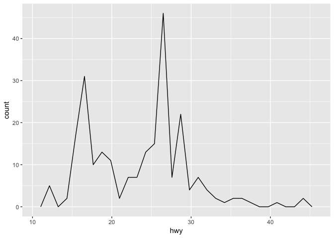<!-- -->
### right

```
## `geom_smooth()` using method = 'loess'
```

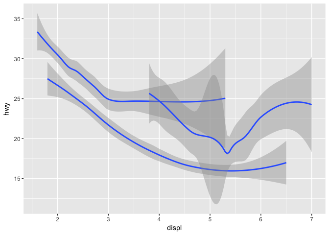<!-- -->
## 3.6.1 Exercises
###1. What geom would you use to draw a line chart? A boxplot? A histogram? An area chart?
geom_smooth(),geom_density(),geom_freqpoly();geom_boxplot();geom_histogram();geom_area(),geom_polygon().
###2.  

```
## `geom_smooth()` using method = 'loess'
```

<!-- -->
how about se?

###3. 

_show.legend_	
_logical. Should this layer be included in the legends? NA, the default, includes if any aesthetics are mapped. FALSE never includes, and TRUE always includes_

###4.

```
## `geom_smooth()` using method = 'loess'
```

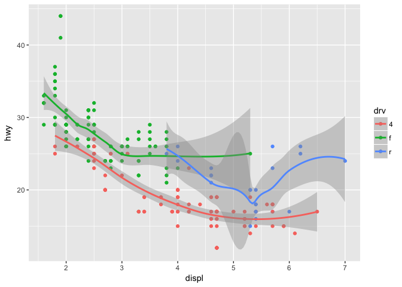<!-- -->

se=false----only show the core line~

###5. They are same.

```
## `geom_smooth()` using method = 'loess'
```

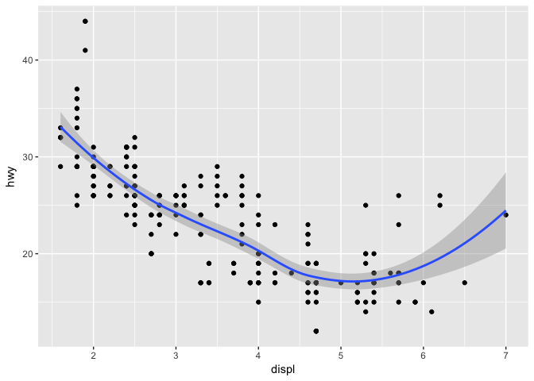<!-- -->


```
## `geom_smooth()` using method = 'loess'
```

<!-- -->

###6.Recreate the R code necessary to generate the following graphs.
(1)

```
## `geom_smooth()` using method = 'loess'
```

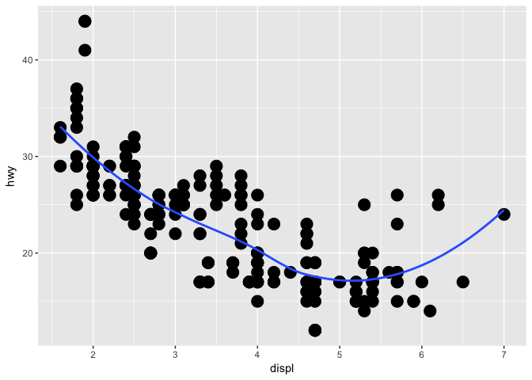<!-- -->

(2)
ggplot(data = mpg, mapping = aes(x = displ, y = hwy)) + 
  geom_point(size=5) + 
  geom_smooth( group = drv,se=FALSE)  
Group should be in the bracket as following, or code won't work. _For upper case, how to change the code?_


```
## `geom_smooth()` using method = 'loess'
```

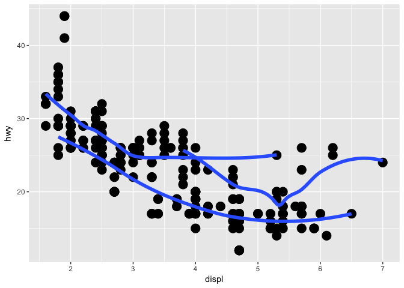<!-- -->

(3)

```
## `geom_smooth()` using method = 'loess'
```

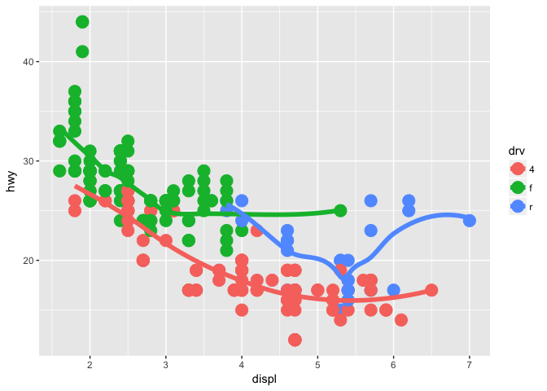<!-- -->

```
## `geom_smooth()` using method = 'loess'
```

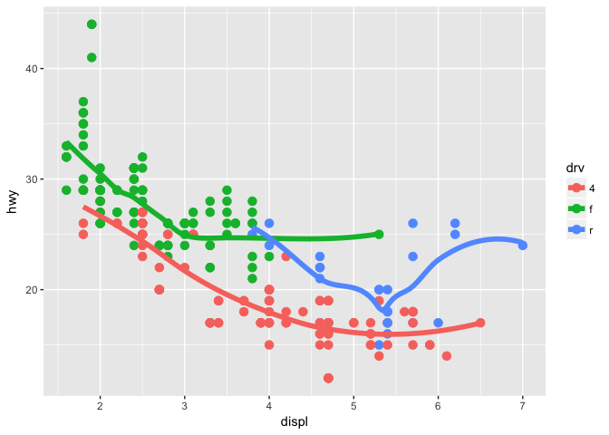<!-- -->

(4)

```
## `geom_smooth()` using method = 'loess'
```

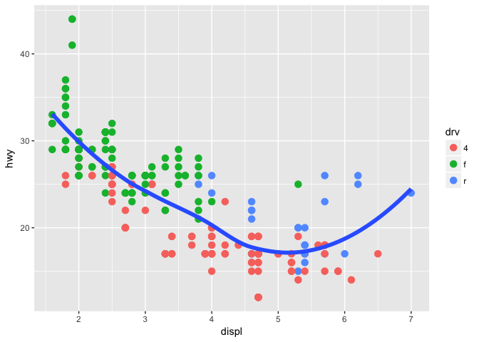<!-- -->

(5)

```
## `geom_smooth()` using method = 'loess'
```

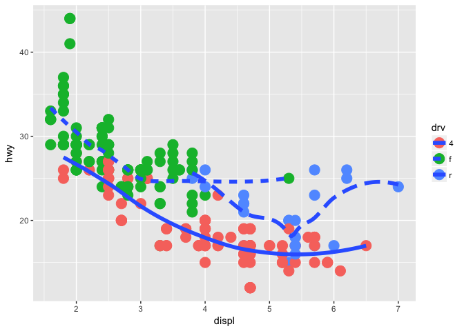<!-- -->

(6)
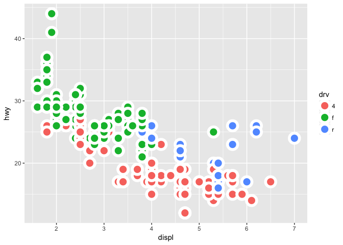<!-- -->

_How about the white outline of legend?_

##3.7.1 Exercises

##1.What is the default geom associated with stat_summary()? How could you rewrite the previous plot to use that geom function instead of the stat function?

geom_pointrange()  
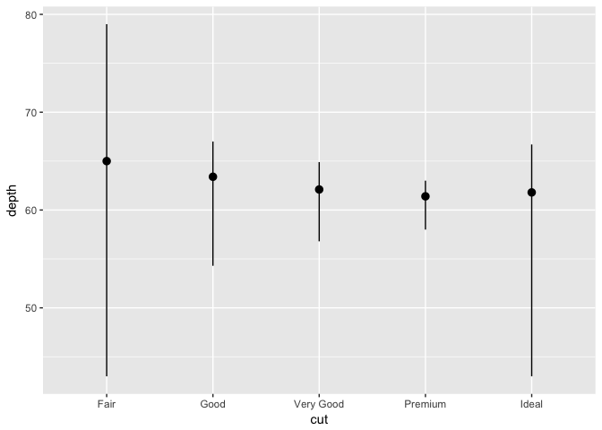<!-- -->


<!-- -->

_oh my, stat="summary"_


### 2.What does geom_col() do? How is it different to geom_bar()?

They are two types of bar charts: geom_bar makes the height of the bar proportional to the number of cases in each group (or if the weight aesthetic is supplied, the sum of the weights). If you want the heights of the bars to represent values in the data, use geom_col instead. geom_bar uses stat_count by default: it counts the number of cases at each x position. geom_col uses stat_identity: it leaves the data as is.


### 3.Most geoms and stats come in pairs that are almost always used in concert. Read through the documentation and make a list of all the pairs. What do they have in common?


### 4.What variables does stat_smooth() compute? What parameters control its behaviour?

Computed variables:
y,predicted value;ymin,lower pointwise confidence interval around the mean;ymax,upper pointwise confidence interval around the mean;se,standard error.

_x,y??_

### 5.In our proportion bar chart, we need to set group = 1. Why? In other words what is the problem with these two graphs?

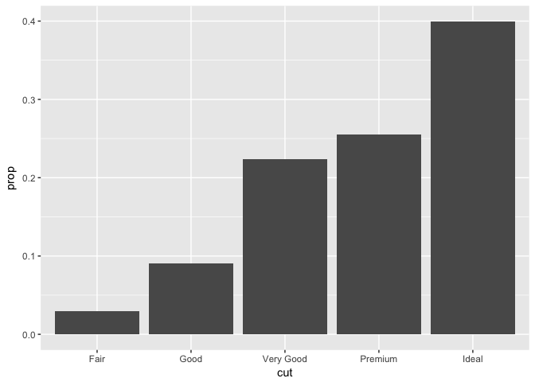<!-- -->
<!-- -->

_fill=color_

## 3.8.1 Exercises   
### 1.What is the problem with this plot? How could you improve it?

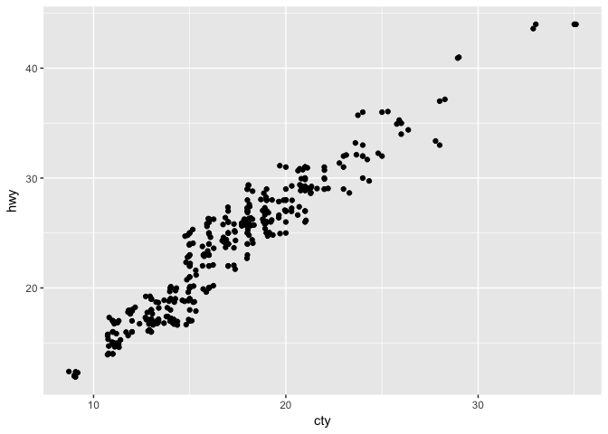<!-- -->


### 2.What parameters to geom_jitter() control the amount of jittering?   

width and height

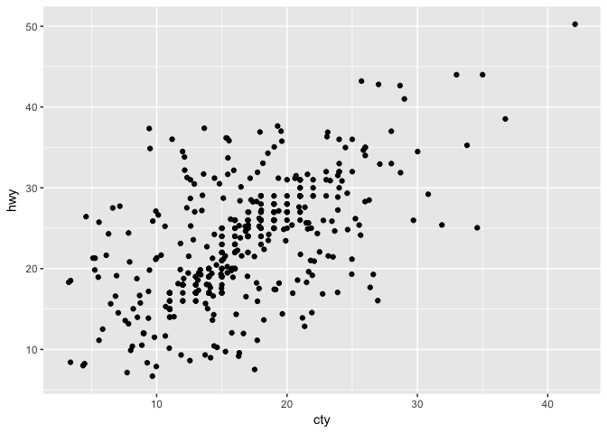<!-- -->


### 3.Compare and contrast geom_jitter() with geom_count().   

The size of each dot was controlled based on the frequency of observations 
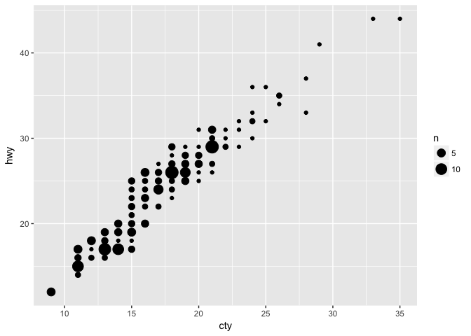<!-- -->

### 4.What’s the default position adjustment for geom_boxplot()? Create a visualisation of the mpg dataset that demonstrates it.


```
## Warning: position_dodge requires non-overlapping x intervals
```

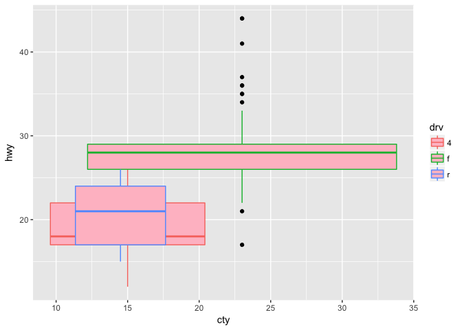<!-- -->

```
## Warning: Continuous x aesthetic -- did you forget aes(group=...)?
```

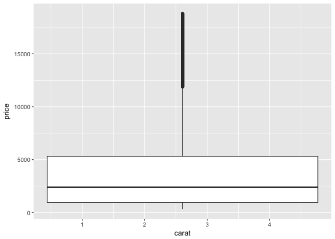<!-- -->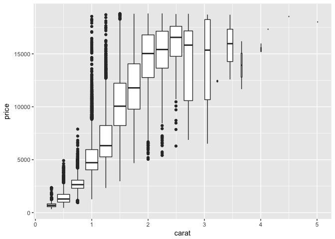<!-- -->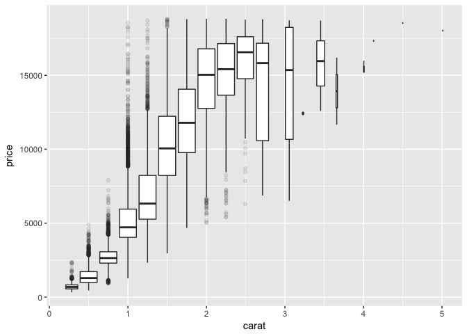<!-- -->

## 3.8 Coordinate system
* coord_flip() switches the x and y axes. **This is useful (for example), if you want horizontal boxplots. It’s also useful for long labels: it’s hard to get them to fit without overlapping on the x-axis.**
* coord_quickmap() **sets the aspect ratio correctly for maps. **This is very important if you’re plotting spatial data with ggplot2 (which unfortunately we don’t have the space to cover in this book).
* coord_polar() uses polar coordinates. Polar coordinates reveal an interesting **connection between a bar chart and a Coxcomb chart.**

example:  

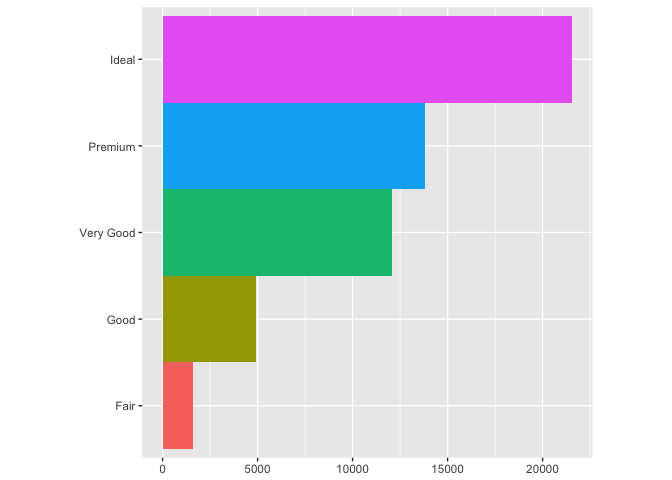<!-- -->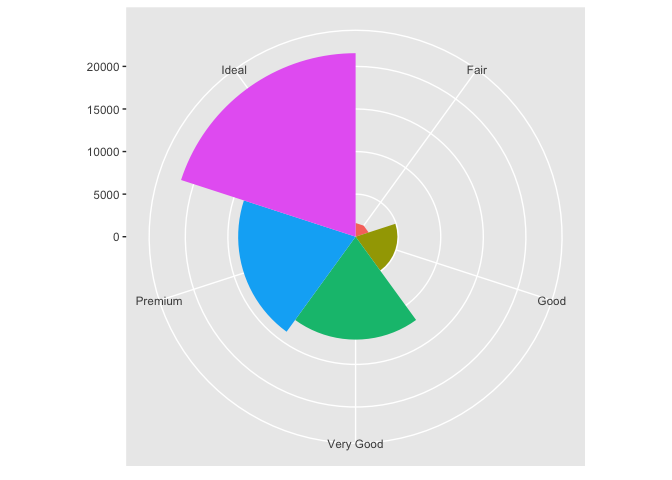<!-- -->

## 3.9.1 Exercises

### 1.Turn a stacked bar chart into a pie chart using coord_polar().  
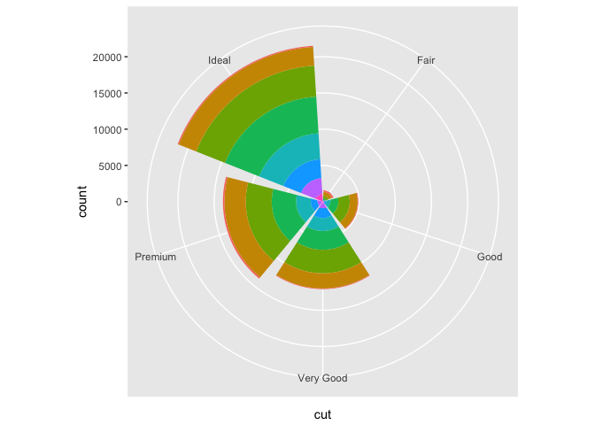<!-- -->


### 2.What does labs() do? Read the documentation.  
Customize the labels as you want~

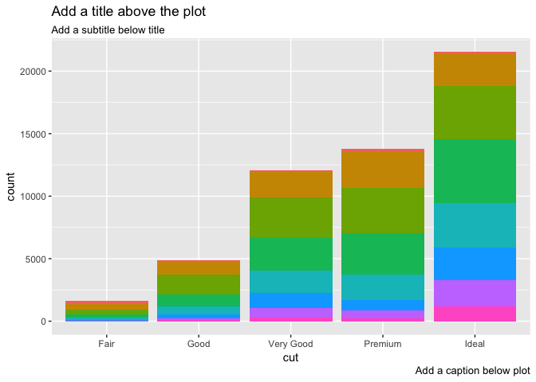<!-- -->


## 3.What’s the difference between coord_quickmap() and coord_map()?  


nz <- map_data("nz")

ggplot(nz, aes(long, lat, group = group)) +
  geom_polygon(fill = "white", colour = "black")

ggplot(nz, aes(long, lat, group = group)) +
  geom_polygon(fill = "white", colour = "black") +
  coord_quickmap()  
_first you should download the data for the map~~_
_coord_quickmap() is very similar to coord_map() but coord_quickmap() preserves straight lines in what should be a spherical plane. So, basically, the earth is shperical and coord_map() preserves that without plotting any straight lines. coord_quickmap() adds those lines._

## 4.What does the plot below tell you about the relationship between city and highway mpg? Why is coord_fixed() important? What does geom_abline() do?

**abline() will render the slope of x,y**  
**fixed() can adjust the aspect ratio.The default is 1/2.**
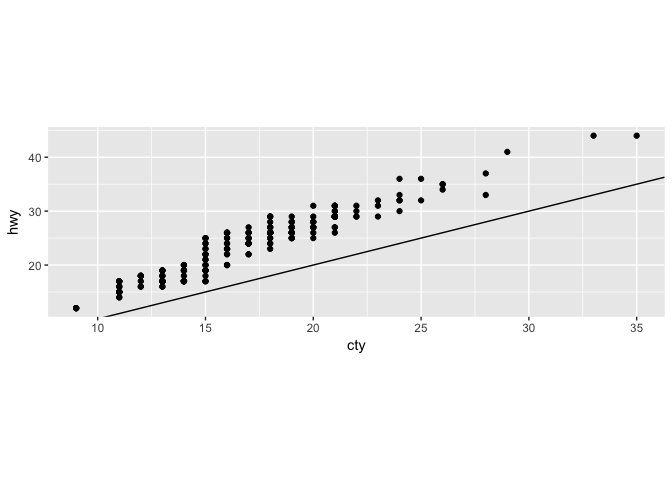<!-- -->


install.packages("readxl")
library(readxl)

```


library(readxl)

datasets <- read_excel("Users / mm / Desktop/GS data.xlsx")

```

