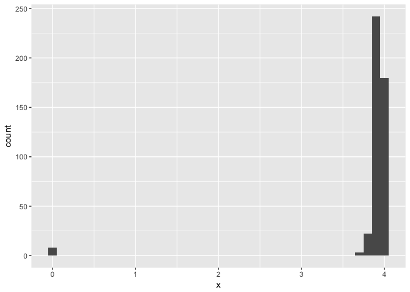

# week 7
huiyingmiao  
May 22, 2017  


```r
library(tidyverse)
```

```
## Loading tidyverse: ggplot2
## Loading tidyverse: tibble
## Loading tidyverse: tidyr
## Loading tidyverse: readr
## Loading tidyverse: purrr
## Loading tidyverse: dplyr
```

```
## Conflicts with tidy packages ----------------------------------------------
```

```
## filter(): dplyr, stats
## lag():    dplyr, stats
```

## 7.3.4 Exercises

### 1 Explore the distribution of each of the x, y, and z variables in diamonds. What do you learn? Think about a diamond and how you might decide which dimension is the length, width, and depth.


```r
ggplot(data = diamonds) +
  geom_bar(mapping = aes(x = x))
```

<!-- -->

```r
diamonds %>% 
  count(x)
```

```
## # A tibble: 554 × 2
##        x     n
##    <dbl> <int>
## 1   0.00     8
## 2   3.73     2
## 3   3.74     1
## 4   3.76     1
## 5   3.77     1
## 6   3.79     2
## 7   3.81     3
## 8   3.82     2
## 9   3.83     3
## 10  3.84     4
## # ... with 544 more rows
```

```r
ggplot(data = diamonds) +
  geom_histogram(mapping = aes(x = x), binwidth = 0.1)
```

<!-- -->

```r
diamonds %>% 
  count(cut_width(x, 0.5))
```

```
## # A tibble: 16 × 2
##    `cut_width(x, 0.5)`     n
##                 <fctr> <int>
## 1         [-0.25,0.25]     8
## 2          (3.25,3.75]     3
## 3          (3.75,4.25]  1834
## 4          (4.25,4.75] 12680
## 5          (4.75,5.25]  7502
## 6          (5.25,5.75]  6448
## 7          (5.75,6.25]  6031
## 8          (6.25,6.75]  9381
## 9          (6.75,7.25]  4193
## 10         (7.25,7.75]  3437
## 11         (7.75,8.25]  1620
## 12         (8.25,8.75]   699
## 13         (8.75,9.25]    79
## 14         (9.25,9.75]    18
## 15         (9.75,10.2]     6
## 16         (10.2,10.8]     1
```

```r
smaller <- diamonds %>% 
  filter(x < 4)
  
ggplot(data = smaller, mapping = aes(x = x)) +
  geom_histogram(binwidth = 0.1)
```

<!-- -->

```r
ggplot(diamonds) + 
  geom_histogram(mapping = aes(x = x), binwidth = 0.5) +
  coord_cartesian(ylim = c(0, 50))
```

<!-- -->


### 2 Explore the distribution of price. Do you discover anything unusual or surprising? (Hint: Carefully think about the binwidth and make sure you try a wide range of values.)

### 3 How many diamonds are 0.99 carat? How many are 1 carat? What do you think is the cause of the difference?

### 4 Compare and contrast coord_cartesian() vs xlim() or ylim() when zooming in on a histogram. What happens if you leave binwidth unset? What happens if you try and zoom so only half a bar shows?

